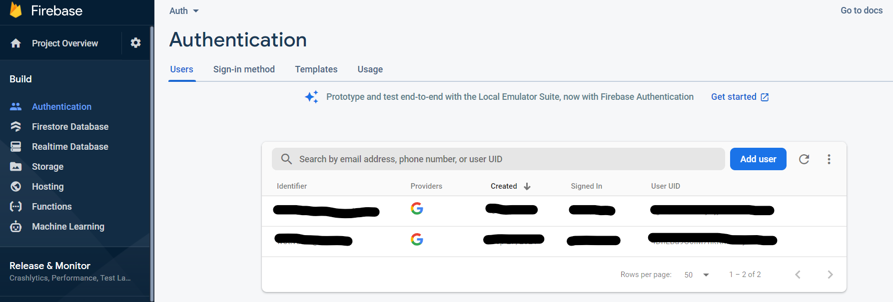

## Task

https://docs.google.com/document/d/1heFuihWrsw14bCpUdr6fla9ysqE6IrsobSMKAOpBiKA/edit#

## How to run the app

Запускатете и работает как швейцарские часы

## Database snapshot

### Authentication

### Database

##Application stack

1) React
2) TypeScript
3) react-router-dom
4) firebase
5) Sass
6) reactStrap
7) eslint
8) prettier
